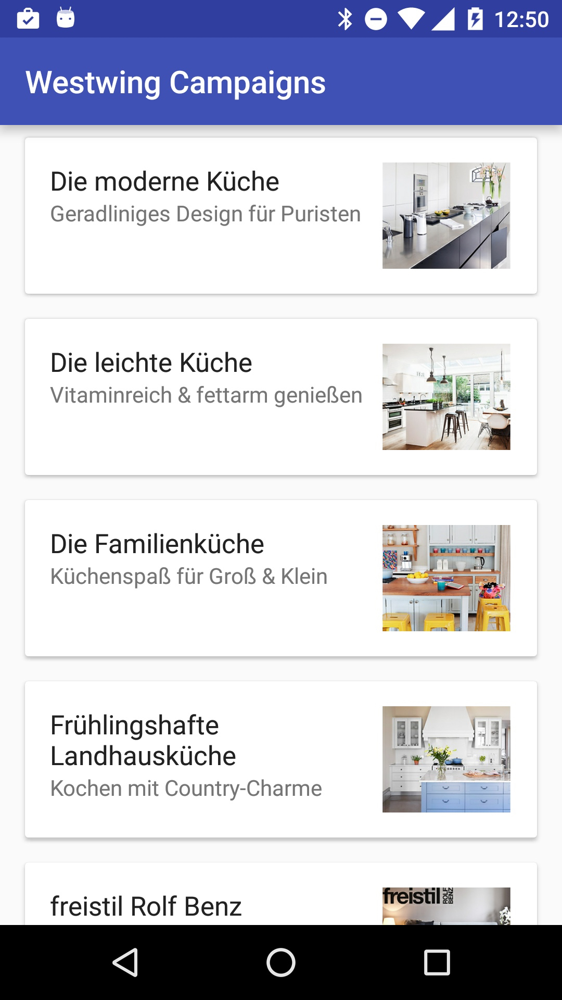

Westwing Campaigns Application
===========================

This repository holds the source code of the Westwing Campaigns Application.
This application was created by [Mohsen Mirhoseini Argi](http://mirhoseini.com), as part of the technical assessment by the [WestWing](http://westwing.de) team.

--------------------
### What is this repository for? ###

* Westwing Campaigns Application
*       Version:  1.0
* Last Update: Wed Jun 29, 2016

--------------------
### Development Tools ###

* Android Studio v2.2
* gradle-plugin v2.10
* Android SDK Build Tools 24.0.0
* CompileSDKVersion 24

--------------------
### Dependencies ###

* Android Support Tools (recyclerView, cardView, vector,... ) v24.0.0
* Retrofit v2.0.0-beta4
* Okhttp v3.2.0
* Dagger v2.4
* RxJava v1.1.3
* RxAndroid v1.1.0
* Picasso v2.5.2
* Butterknife v8.0.1
* Timber v4.1.2
* AndroidUtils v1.0.0
* jUnit v4.12
* Android Test v0.4.1
* Mockito v1.10.19
* Robolectric v3.1-rc1
* Espresso v2.2.2

--------------------
### Important Notes ###

The application displays a list of campaigns with multiple items. It uses a static JSON remote data source accessible through standard HTTP.

The MainActivity is responsible for presenting campaigns data using CampaignListFragment. Campaigns' Data API call are done using RxJava.

All activity lifecycle and network behaviours are implemented, and according to device size and situation user get a good view and UX. In case having update cache data in Disk, app do not call Network. In case of no internet connection and no cache data, a dialog pops up and ask user to turn on it's network.

A combination of cached data in Disk and Network call makes Application work smooth and a result a good UX.

Some Test Cases was designed to test application UI functionality and inner classes using jUnit and AndroidUnitTest.

### Application Structure ###

The Application implemented and structured bases on the MVP pattern best practice, contributed by [Antonio Leiva](http://antonioleiva.com/mvp-android/).

The "App" module contain all core and UI functionality codes required for application to load on Android.

The view (MainActivity, CampaignListFragment), contain a reference to the presenter. The only thing that the view will do is calling a method from the presenter every time there is an interface action.

The presenter (MainPresenter, CampaignPresenter), is responsible to act as the middle man between view and model(CampaignInteractor). It retrieves data from the model and returns it formatted to the view. It also decides what happens when you interact with the view.

The model (CampaignInteractor), would only be the gateway to the domain layer or business logic. In this case it provide the data we want to display in the view from Network or cached data from disk.

The networking and API call are managed by [Retrofit](http://square.github.io/retrofit/) and OkHttp as its httpclient, contributed by [Square](http://square.github.io). Disk cache is also provided using this library, api call cache for 2 min and stall offline for 7 days. It also shows decent logs while application is running in Debug mode.

Campaign's image and banner are loaded and cached using [Picasso](http://square.github.io/picasso/), contributed by [Square](http://square.github.io).

Layout parts communications are managed by [RxJava](https://github.com/ReactiveX/RxJava) & [RxAndroid](https://github.com/ReactiveX/RxAndroid) contributed by [ReactiveX](http://reactivex.io).

Dependency Injections are being managed by [Dagger](https://github.com/google/dagger) created by [Square](http://square.github.io) and now maintained by Google [Google](http://google.github.io/dagger/).

Some minor Android common functions are managed using [AndroidUtils](https://github.com/mmirhoseini/utils) library, developed and published on jCenter by [myself](http://mirhoseini.com).

Whole projects Dependencies are placed in "libraries.gradle" to avoid version conflicts and redundant in modules.

For a better UI used new vector support with some SVG Vector images for a better UI.

I am also a fan of Functional Programming and always use Retrolambda to use this ability in all Android versions, and try to think more functional.

For a better UI/UX I prefer to add banner image inside the campaign details activity instead of the the simple image.